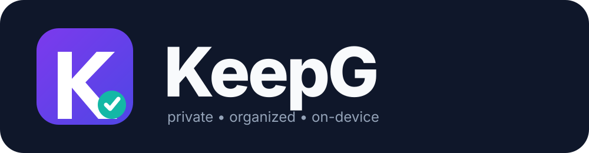
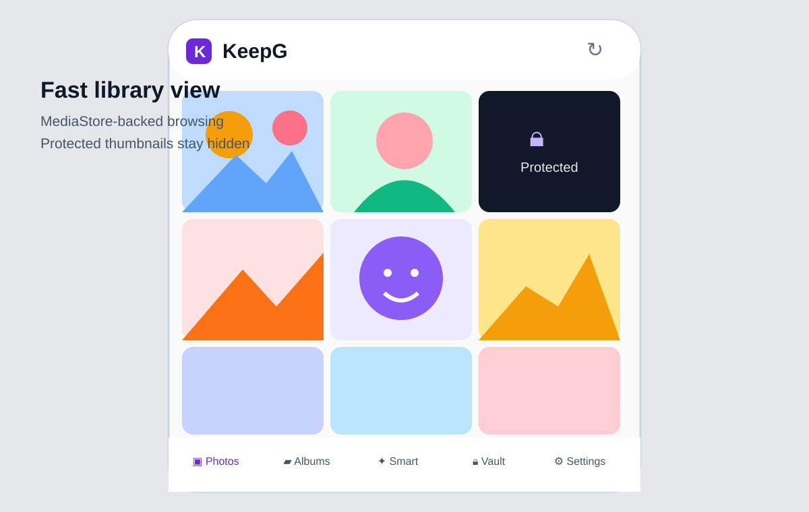
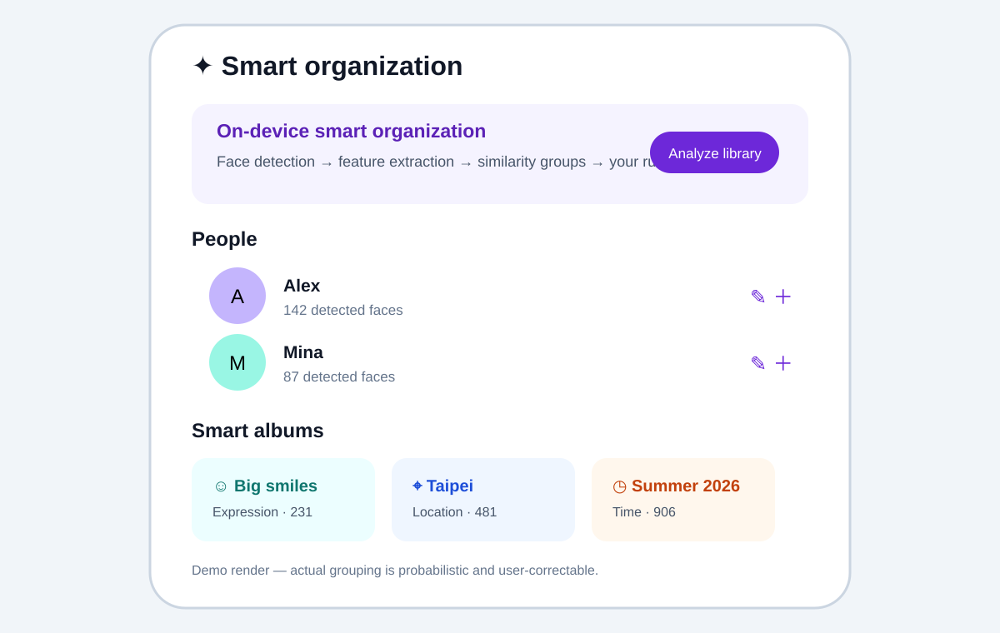
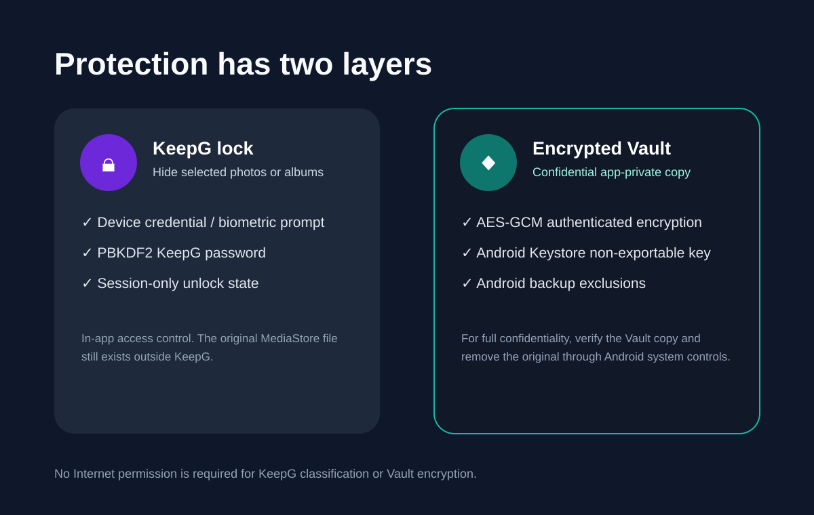
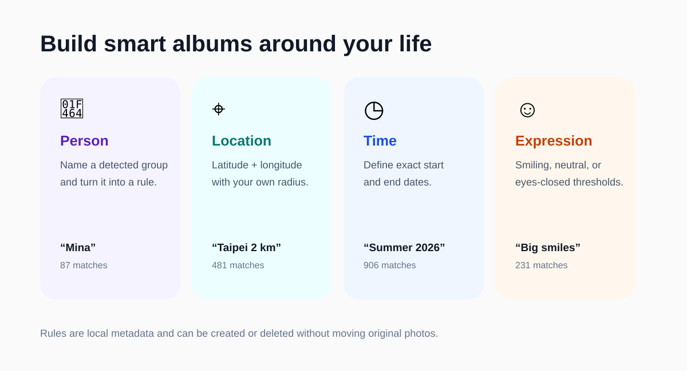

<p align="center">
  
</p>

<p align="center">
  <strong>A privacy-first Android gallery with broad media support, local smart organization, protected media, editing tools, and an encrypted Vault.</strong>
</p>

<p align="center">
  <a href="../../actions/workflows/android.yml"></a>
  
  
  
</p>

## What KeepG is

KeepG is an Android media manager intended to replace a basic device gallery while keeping sensitive organization data local. It indexes Android MediaStore images and videos, browses device albums, creates logical Collections, protects selected photos or albums, creates AES-GCM encrypted Vault copies, and provides on-device smart organization for people, time, location, and facial-expression rules.

KeepG has two editions:

| Edition | Purpose | Application ID |
|---|---|---|
| **KeepG Full** | Complete security, smart organization, editor, QR/URL detection, repair and Vault experience | `com.yanagikh.keepg` |
| **KeepG Lite** | Small, straightforward gallery with image/video browsing, albums and Collections | `com.yanagikh.keepg.lite` |

The separate application IDs allow Full and Lite to be installed on the same Android device.

## Interface demos

> These SVGs are repository demo renders of the implemented information architecture and flows. Exact spacing and Android system chrome vary by device/theme.

### Library and protected thumbnails

<p align="center"></p>

- Adaptive Compose media grid backed by Android MediaStore.
- Image and video thumbnails; video items are marked with a play indicator.
- Protected media is replaced with a locked state until successful authentication.
- Long-press an unlocked image in Full edition to scan QR codes, barcodes and visible web URLs.

### Local people grouping and smart albums

<p align="center"></p>

- ML Kit face detection runs on the device.
- KeepG extracts a compact local visual descriptor plus pose/expression signals.
- Cosine-similarity grouping proposes likely same-person clusters.
- Users can rename person groups and create person/time/location/expression rules.

### Protection and encrypted Vault

<p align="center"></p>

- **Device lock:** Android `BiometricPrompt` with supported strong biometric/device credential.
- **KeepG password:** PBKDF2-HMAC-SHA256, random salt, 210,000 iterations and constant-time verification.
- **Vault:** AES-GCM encrypted app-private files with a non-exportable Android Keystore key.
- Room, preferences and Vault storage are excluded from normal Android cloud backup paths.

### User-defined organization rules

<p align="center"></p>

| Rule | Matching source | Example |
|---|---|---|
| Person | Local face cluster | `Mina` |
| Time | Media capture timestamp | `2026-06-01` through `2026-08-31` |
| Location | EXIF coordinates + Haversine radius | `25.0330, 121.5654 within 2 km` |
| Expression | ML Kit smile/eye probabilities | `smiling >= 0.80` |

## Broad media support

KeepG indexes both Android image and video MediaStore collections. Its extension/MIME registry recognizes common and less-common media including:

- images: JPEG/JPG/JPE/JFIF, PNG, WebP, GIF, BMP/DIB, HEIC/HEIF, AVIF, DNG, TIFF/TIF, ICO, WBMP and SVG;
- videos: MP4/M4V, MOV, 3GP/3GPP/3G2, MKV, WebM, AVI, MPEG/MPG, TS/MTS/M2TS and OGV.

Recognition and decoding are separate concerns. Android/OEM codecs determine whether a specific encoded file is viewable. KeepG uses Coil video/SVG integration for thumbnails and Android platform decoders for native raster media.

## Non-destructive editor (Full)

Image editing writes a new result under `Pictures/KeepG`; it does not overwrite the source.

- rotate 90° right;
- horizontal flip;
- grayscale;
- center square crop;
- automatic person/background removal using bundled on-device ML Kit selfie segmentation;
- adjustable manual corner-color background removal;
- GIF first-frame extraction to alpha-capable PNG.

Video editing writes a new MP4 under `Movies/KeepG` using Android `MediaExtractor`/`MediaMuxer`:

- trim to the first five seconds;
- remove audio tracks (muted copy).

Video operations remux rather than transcode. A codec can be playable on a device yet be incompatible with MP4 remuxing; KeepG reports that case and leaves the original untouched. Animated GIF re-encoding is not claimed: the explicit GIF action extracts the first decoded frame.

## QR, barcode and visible URL detection (Full)

Long-press an unlocked image thumbnail or choose **Links** in media detail. KeepG combines bundled ML Kit barcode scanning and Latin text recognition. Results are normalized and only `http://` or `https://` URLs are offered to the user. Opening a result leaves KeepG and launches the user's external browser.

KeepG itself still declares **no `INTERNET` permission**. It does not fetch the destination page; the browser does.

## File/date repair (Full)

**Repair** creates a recovered copy rather than rewriting the source in place. The repair path:

- normalizes MIME/extension expectations;
- replaces clearly invalid capture dates with a safe timestamp when requested;
- re-encodes decodable images into a portable recovered copy;
- remuxes compatible video tracks into MP4.

Repair cannot reconstruct media payload that is already undecodable or irrecoverably corrupted. The original remains untouched when recovery fails.

## Debug settings and logs

Settings contains a persistent debug switch plus **View log**, **Export log**, and **Clear** actions.

- active log: app-private `files/debug/keepg.log`;
- rotates at 2 MiB to `keepg.log.1`;
- export uses Android's document picker;
- logs are never automatically uploaded;
- passwords, derived keys, Android Keystore keys and decrypted Vault bytes must never be logged.

See [`DEBUGGING.md`](DEBUGGING.md) for ADB/logcat procedures and editor/repair troubleshooting.

## Gallery, protection and Vault

Device albums remain Android-managed. KeepG Collections are non-destructive logical albums. Full edition can protect an individual photo or an entire device album with Android device authentication or a target-specific KeepG password. Unlocking is session-scoped.

A KeepG lock controls visibility **inside KeepG**. It does not encrypt the original MediaStore file or stop another gallery from reading that original. For confidentiality against other apps, create a Vault copy, verify it, then remove the original using Android's normal destructive-confirmation flow.

Vault copies are AES-GCM `.kgv` files in app-private storage. The key is generated in Android Keystore and is not exported to the Room database or repository.

## Smart organization

```text
MediaStore image
  -> bitmap decode
  -> ML Kit face detection
  -> padded face crop
  -> normalized local visual descriptor
  -> pose + smile + eye-open signals
  -> cosine-similarity cluster matching
  -> user-correctable person group
```

This is an organizational heuristic, **not biometric identity verification**. Similarity mistakes are possible and should be corrected by the user.

## Architecture

```text
Compose UI
   │
MainViewModel
   ├── MediaStoreRepository ── Images + Video MediaStore
   ├── KeepGDatabase (Room)
   ├── FaceAnalysisEngine
   ├── AdvancedFeatureTools
   │    ├── QR/barcode + OCR URL detection
   │    ├── image/GIF editor
   │    ├── background segmentation
   │    ├── video remux editor
   │    └── recovered-copy repair
   ├── KeepGLog
   └── VaultRepository ── VaultCipher ── Android Keystore AES-GCM
```

`AdvancedFeatureTools` has flavor-specific implementations: Full provides the advanced engine and Lite provides a small no-op boundary. See [`ARCHITECTURE.md`](ARCHITECTURE.md).

## Security model

KeepG has no app Internet permission. Security-relevant behavior is documented in [`SECURITY.md`](SECURITY.md), including authentication modes, PBKDF2 parameters, AES-GCM Vault format, Android Keystore use, face metadata privacy, threat boundaries and key-loss behavior.

## Development setup

### Requirements

- JDK 17
- Android SDK 35
- Build Tools 35.0.0
- Gradle 8.10.2
- Android Studio (recommended)

```bash
gradle :app:lintFullDebug :app:lintLiteDebug --stacktrace
gradle :app:testFullDebugUnitTest :app:testLiteDebugUnitTest --stacktrace
gradle :app:assembleFullDebug :app:assembleLiteDebug --stacktrace
gradle :app:connectedFullDebugAndroidTest :app:connectedLiteDebugAndroidTest --stacktrace
```

## GitHub Actions and Releases

`.github/workflows/android.yml` verifies both editions:

1. **build-test-lint** — Full/Lite lint, JVM tests and APK assembly.
2. **instrumentation** — Full/Lite Android tests on an API 35 x86_64 emulator.

`.github/workflows/release.yml` runs only after a successful Android CI run on `main` (or an explicit manual dispatch). It builds and attaches:

- Full and Lite installable debug-signed APKs;
- universal and ABI-specific APKs when produced by AGP (`arm64-v8a`, `armeabi-v7a`, `x86_64`);
- Full/Lite AAB bundles;
- `SHA256SUMS.txt`.

Automatic GitHub prerelease APKs deliberately use Android's test/debug signing identity so they are immediately installable for testing. AABs require a production signing/store pipeline before store distribution. No production private key is committed to this repository.

## Android permissions

- `READ_MEDIA_IMAGES` and `READ_MEDIA_VIDEO` on Android 13+;
- `READ_MEDIA_VISUAL_USER_SELECTED` on Android 14+;
- legacy `READ_EXTERNAL_STORAGE` only through Android 12L;
- `ACCESS_MEDIA_LOCATION` for EXIF location rules;
- `USE_BIOMETRIC` for device authentication.

There is intentionally no `INTERNET` permission.

## Current limitations

- Actual codec support varies by Android version/OEM despite KeepG recognizing a broad extension set.
- GIF animation is viewable where the decoder supports it, but the current editor exports a selected first-frame PNG rather than re-encoding animated GIF frames.
- Video edit operations are lossless remux operations; incompatible source tracks require a future transcoding path.
- Automatic background removal uses ML Kit Selfie Segmentation, which Google currently documents as beta.
- Person grouping uses a lightweight local descriptor and is not biometric verification.
- Vault creation does not silently delete the original MediaStore item.
- Device-credential UX depends on Android device capabilities and policy.

## Privacy

See [`PRIVACY.md`](PRIVACY.md). KeepG is accountless, has no app Internet permission, stores organization metadata locally, and treats local face descriptors as sensitive data.

## Verification philosophy

No non-trivial gallery/security application can honestly promise it will never contain a defect. KeepG instead requires reproducible lint, unit tests, API-level instrumentation, explicit CI, checksummed release assets, a documented threat model and a debugging checklist. Security-sensitive changes should strengthen those checks rather than bypass them.
